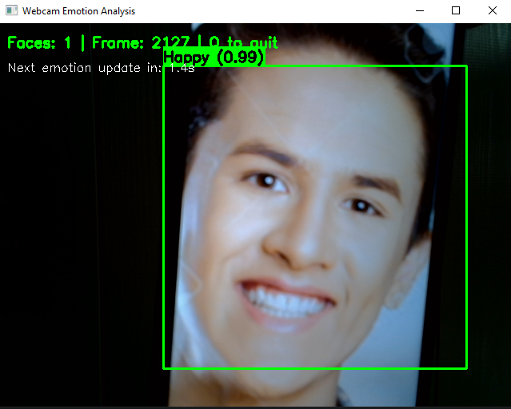

# 🎥 Распознавание эмоций по видео с веб-камеры

Приложение для анализа эмоционального состояния человека по видеопотоку с веб-камеры в реальном времени.

## 🌟 Возможности

- Обнаружение лиц в видеопотоке в реальном времени
- Распознавание 7 основных эмоций
- Визуализация результатов с цветовыми индикаторами
- Оптимизация производительности за счет кэширования эмоций
- Стабильная работа на CPU

## 🚀 Быстрый старт

### Установка
```bash
git clone -b video-emotion-analyzer https://github.com/WhiteJohny/Pringe video-emotion-analyzer
cd video-emotion-analyzer
pip install -r requirements.txt
```

### Запуск
```bash
python main.py
```

## 💡 Пример работы

После запуска откроется окно с видеопотоком с вашей веб-камеры.
Когда приложение обнаружит лицо, оно будет выделено прямоугольником, 
а над прямоугольником будет отображена распознанная эмоция с уровнем уверенности.

```bash
╔══════════════════════════════════════════════╗
║           VIDEO EMOTION ANALYSIS             ║
║           Real-time Emotion Detection        ║
╚══════════════════════════════════════════════╝
    
🔄 Loading models...
📦 Loading emotion model...
✅ Models loaded successfully!

🎯 SELECT MODE:
1. Webcam analysis (real-time)
2. Exit

Enter choice (1-2) > 1
🎥 Starting webcam...
💡 Press 'q' to exit
💡 Emotions update every 2 seconds for stability
🔄 Processing emotions for 1 faces...
🔍 Detected: 'happy' (0.99)
```


## 🛠 Управление

* q - выход из приложения

* Эмоции автоматически обновляются каждые 2 секунды для стабильности

* Информационная панель показывает количество лиц и время до следующего обновления

## 🏗 Технологии

* Модель распознавания эмоций: trpakov/vit-face-expression (Vision Transformer)

* Детекция лиц: OpenCV Haar Cascade Classifier

* Библиотеки: OpenCV, Hugging Face Transformers, PIL

* Поддерживаемые эмоции: 
  * 😠 Angry (Злость)
  * 🤢 Disgust (Отвращение)
  * 😨 Fear (Страх)
  * 😊 Happy (Радость)
  * 😢 Sad (Грусть)
  * 😮 Surprise (Удивление)
  * 😐 Neutral (Нейтральность)

