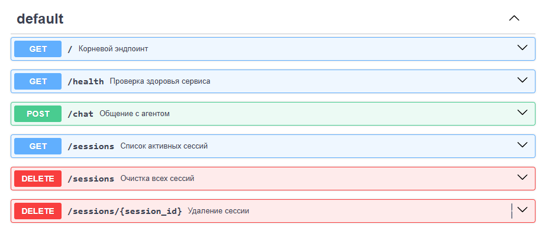

# DoubleAgent

DoubleAgent — интеллектуальный ассистент, объединяющий функционал работы с календарём и генерации шуток. Для работы с ним можно воспользоваться API.

## Требования

- Python 3.8+
- Ollama
- Google Calendar API
- FastAPI

### Установка зависимостей

```bash
pip install -r requirements.txt
```

## Настройка Ollama

### Установка Ollama

1. Перейдите на официальный сайт [Ollama](https://ollama.ai)
2. Скачайте и установите версию для вашей операционной системы
3. Запустите Ollama для активации сервиса

### Загрузка модели

Откройте терминал/командную строку и выполните команду:

```bash
ollama pull deepseek-r1:8b
```
Дождитесь завершения загрузки модели.

## Настройка Google Calendar API

### Создание проекта в Google Cloud Console

1. **Перейдите в Google Cloud Console**
   - Откройте [console.cloud.google.com](https://console.cloud.google.com)
   - Войдите в свой Google аккаунт

2. **Создайте новый проект**
   - Нажмите на выпадающий список проектов в верхней панели
   - Нажмите **"New Project"**
   - Введите название проекта (например, "DoubleAgent")
   - Нажмите **"Create"**

3. **Включите Google Calendar API**
   - В боковом меню перейдите в **"APIs & Services"** → **"Library"**
   - В поиске введите "Google Calendar API"
   - Выберите **"Google Calendar API"** из результатов
   - Нажмите кнопку **"Enable"**

### Создание учетных данных OAuth 2.0

4. **Настройка OAuth-согласия**
   - Перейдите в **"APIs & Services"** → **"OAuth consent screen"**
   - Выберите **"External"** тип пользователей
   - Заполните обязательные поля:
     - Название приложения: "DoubleAgent"
     - Email пользователя: ваш email
   - Нажмите **"Save and Continue"**

5. **Создание Client ID**
   - Перейдите в **"APIs & Services"** → **"Credentials"**
   - Нажмите **"Create Credentials"** → **"OAuth client ID"**
   - Выберите **"Desktop Application"** в качестве типа приложения
   - Введите название клиента (например, "DoubleAgent Desktop")
   - Нажмите **"Create"**

6. **Скачивание файла credentials.json**
   - После создания клиента появится всплывающее окно с данными
   - Нажмите кнопку **"Download JSON"**
   - Сохраните файл как `client_secret.json`
   - Поместите файл в корневую директорию вашего проекта

### Проверка настроек

Убедитесь, что в разделе **"Credentials"** отображается:
- ✅ Google Calendar API включен
- ✅ OAuth 2.0 Client ID создан
- ✅ Файл `client_secret.json` скачан и размещен в проекте

## API

### Запуск API
```bash
python fastapi_app.py
```
После чего API будет доступен на localhost:8000

### Endpoints
Подробно прочитать можно, например, здесь localhost:8000\docs 
* 